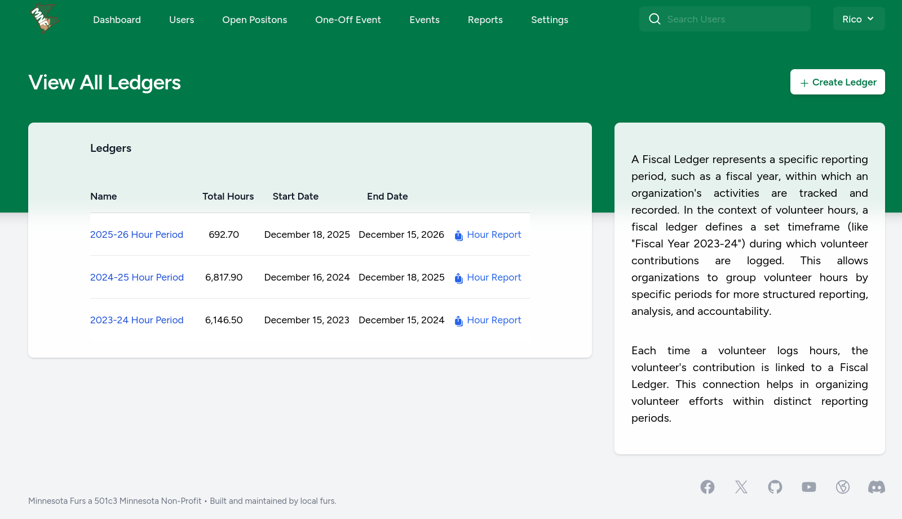

# Fiscal Ledgers

> Ledgers are required and must be defined.

A Fiscal Ledger in this volunteer-hour tracking system represents a defined period of time during which volunteer hours are tracked and reported together. Think of it like a “reporting year” or “hours accounting period.”

Nonprofit organizations often need to separate volunteer time into distinct reporting buckets, for example a convention year, a calendar year, or a grant period. Because hours may need to be exported, counted toward different recognition programs, or reported to funders differently. Tracking hours in separate ledgers helps ensure clarity and organization.

In accounting terms, a ledger collects a set of related activity within a named period so you can summarize, analyze, and report that activity as a group. For volunteer hours, a fiscal ledger might cover a defined span like January 1 – December 31 of a calendar year, or June to May for an event cycle. It serves as the authoritative grouping for all hour entries that should be counted together.

Without ledgers, all volunteer hours would live in a single undifferentiated table. Ledgers give structure: you can ask “how many hours were served in 2026?” or “how many hours went to on-site roles vs virtual for the 2025 convention cycle?” or “which volunteers crossed 100 hours this ledger?”.

# Creating a Ledger

1. Log in as an admin or user with ledger-management permissions.
2. Navigate to Settings > Fiscal Ledgers (or similar).
3. Click "Create Ledger".
4. Enter a Name such as “2026 Convention Year”.
5. Enter a Start Date and End Date that define the period you want to track. 
    (**Example:** Start 2026-01-01, End 2026-12-31.)
6. Save the ledger.